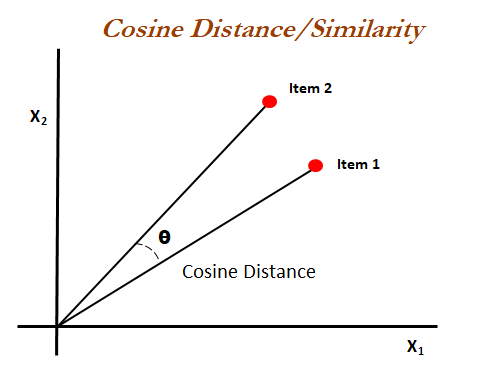

# Moive Recommendation System with Sentiment Analysis 

## Overview

This project implements a robust movie recommendation system with sentiment analysis using MLops concepts. The system collects movie data including information about the cast, crew, and reviews. It utilizes the TMDb API for fetching movie data. The recommendation system is based on cosine similarity, providing accurate recommendations even for movies not present in the dataset and adding that new movie info in our database.

## Features

- Collects movie data including cast, crew, reviews and other info using APIs.
- Implements a recommendation system based on cosine similarity.
- Dynamically fetches movie information from the TMDb API if a movie is not present in the dataset.
- Performs sentiment analysis on movie reviews.
- Displays movie recommendations and sentiment analysis results on a web interface using flask.

## Usage

## Architecture

## Similarity Score : 

   How does it decide which item is most similar to the item user likes? Here come the similarity scores.
   
   It is a numerical value ranges between zero to one which helps to determine how much two items are similar to each other on a scale of zero to one. This similarity score is obtained measuring the similarity between the text details of both of the items. So, similarity score is the measure of similarity between given text details of two items. This can be done by cosine-similarity.
   
## How Cosine Similarity works?
  Cosine similarity is a metric used to measure how similar the documents are irrespective of their size. Mathematically, it measures the cosine of the angle between two vectors projected in a multi-dimensional space. The cosine similarity is advantageous because even if the two similar documents are far apart by the Euclidean distance (due to the size of the document), chances are they may still be oriented closer together. The smaller the angle, higher the cosine similarity.

## Data Source

1. [TMDB APIs](https://developer.themoviedb.org/reference/intro/getting-started)

2. [Movie Review Dataset for Sentiment Analysis](https://www.kaggle.com/datasets/lakshmi25npathi/imdb-dataset-of-50k-movie-reviews)
 
